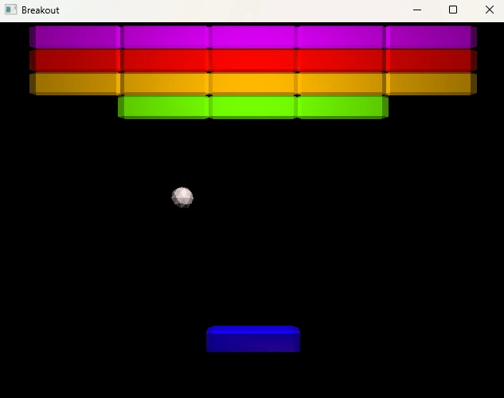

# Breakout Ogre

Basic Breakout implementation using the Ogre rendering engine.

- Ogre is added as a git submodule for convenience. So you need to run 'git submodule update --init --recursive' after cloning this repository.
- The project is organized via CMake using CMakePresets.json and is meant to be built with Visual Studio.
- Ogre has many cmake options, so using cmake-gui can be a bit overwhelming for new commers. It is recomended to use the default preset 'vs-debug'.
- Running 'cmake --preset vs-debug' at the root of the repository will generate the solution and project files at '../build'.
- Ogre will build its dependencies at cmake configure step, as specified by default in the CMakeLists.txt of Ogre (it will take a few minutes).
- In Visual Studio, you need to build the whole solution using the 'Debug' build configuration, and then build the 'CMakePredefinedTargets/INSTALL' target to make the assets available to your executable.
- The install folder is located at '../install'.

*At the moment, this has only been tested on Windows with Visual Studio 17 2022 and on Debug build.*

